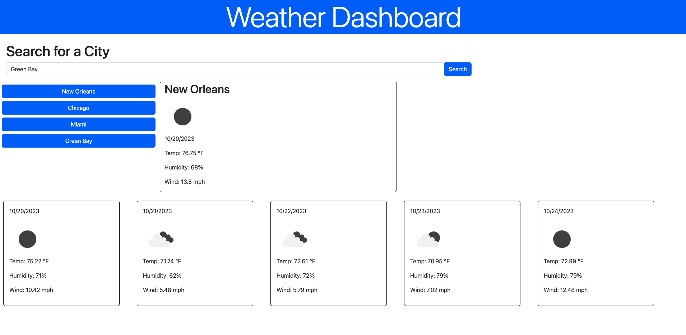

# Five Day Forecast

## Description
Weather dashboard created by searching by city name to display the current weather and a five day forecast.

### Features
* Clickable search history
* Search by city name
* Dynamically display weather and forecast
* Weather icon representations, date, temperature, and humidity data

### API used
* OpenWeatherMap API

### Screenshot

### Links

* Github [Repository](https://github.com/micahives/FiveDayForecast)
* Deployed application [URL](https://micahives.github.io/FiveDayForecast/)